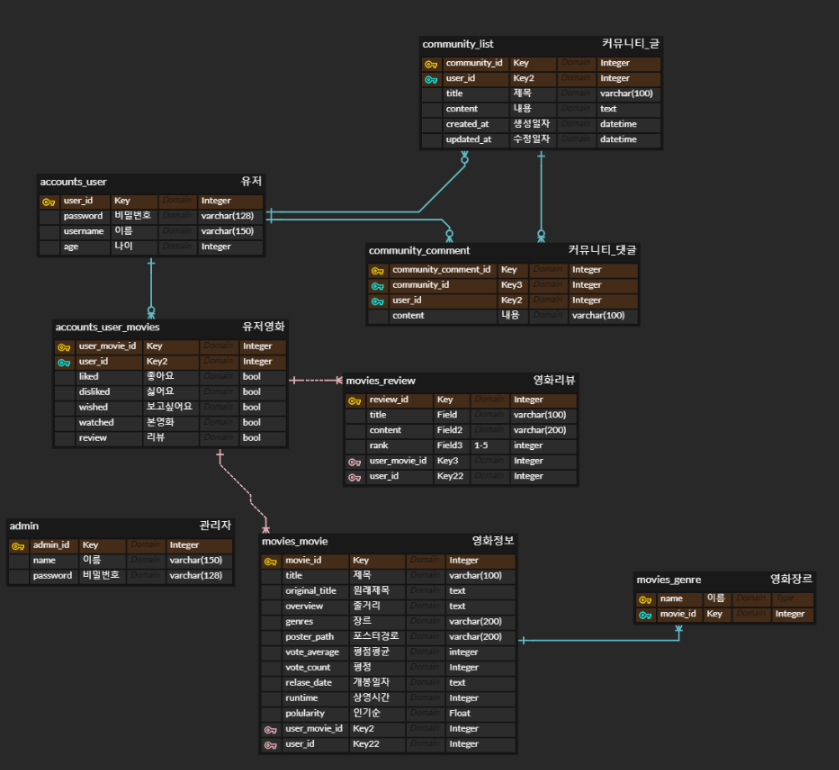
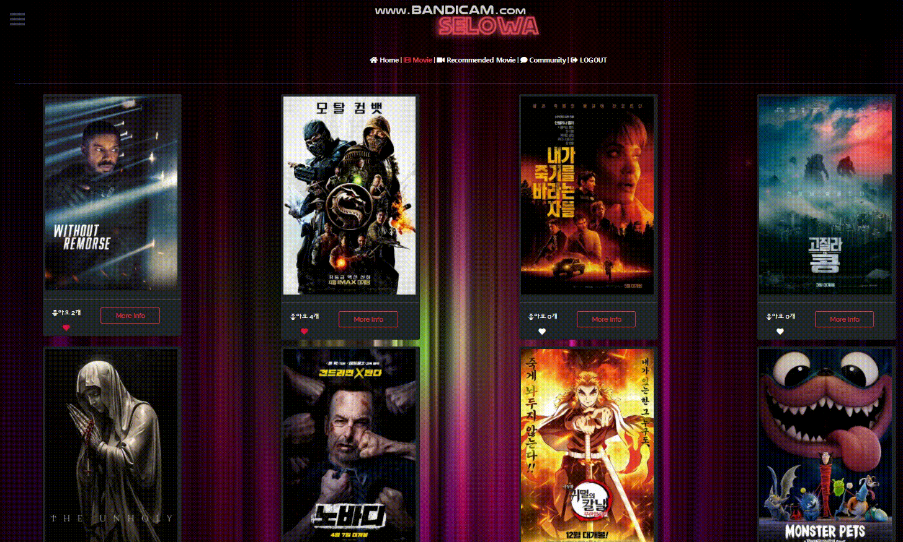

# Final Project 

# [SELOWA] 영화 추천 서비스 :movie_camera:

# 광주 2반 권예빈, 최정윤

## 로고,서비스이름


영화를 보다. 라는 아이디어에서 착안되었다.

"보다"라는 동사를 의미하는 영어 단어 세가지인  **SE**E **LO**OK **WA**TCH를 앞에서 두 글자씩 따왔다. 

## 데이터베이스 모델링(ERD)



## 프로토타입 :desktop_computer:

https://www.figma.com/file/GAJvqStrelOOzMfDR4EiSR/Untitled?node-id=42%3A68

## 주요 업무분담 

| 범위       | 프레임워크 | 주로 맡은 사람 |
| ---------- | ---------- | -------------- |
| 백엔드     | django     | 최정윤         |
| 프론트엔드 | vue.js     | 권예빈         |


## 필수 기능 설명 :fire:

**영화데이터 수집**

- The Movie Database(TMDB) 사이트를 통해 데이터를 가져오고 JSON파일로 저장시킴 (Python으로 가져옴)
- fixtures를 이용해서 json으로 저장된 데이터를 데이터베이스에 저장시킴
- 장르의 경우는 숫자로 되어 있어서 그에 따른 정보를 먼저 불러온 뒤에 사용

```python
$ python manage.py loaddata movies/fixtures/genres.json
$ python manage.py loaddata movies/fixtures/movies.json
```


**A. 관리자 뷰**

* Django가 제공해주는 admin 기능을 이용해서 구현함

> admin.py 에 관리한 모델 등록


**회원가입 로그인**

<video src="../../Users/yebeen/Documents/Bandicam/bandicam 2021-07-07 17-47-06-600.mp4"></video>


**B. 영화 정보**

- Django fixtures를 이용해서 영화정보를 저장시킴

```bash
$ python manage.py loaddata movies/fixtures/genres.json
$ python manage.py loaddata movies/fixtures/movies.json
```

* 모든 로그인 된 유저는 영화에 대한 평점 등록 / 수정 / 삭제 등을 할 수 있 어야 합니다.

> custom-modal만들어서 해결




**C. 추천 알고리즘**


* 랜덤 추천

> lodash를 사용해 랜덤추천을 구현함

```javascript
getMovieDatas: function () {
    axios.get(`${SERVER_URL}/movies/`)
        .then( (res) => {
        //랜덤추천 
        const randomIdx = _.random(res.data.length-1)
        this.movie = res.data[randomIdx]
        const numbers = _.range(1, res.data.length);
        const sampleNums = _.sampleSize(numbers, 30);

        for (const key in sampleNums) {
            this.movies.push(res.data[sampleNums[key]])
        }
    })
    //     .catch( (err) => {
    //     console.log(err)
    // })
}
```

* '좋아요'한 영화 기반 추천

> 내가 좋아요누른 영화를 남이 좋아요 눌렀으면 남이 좋아하는 영화가 무엇인지 찾고 추천

```javascript
   getRecommend: function () {
      const config = this.getToken()
      const item = {
        movies: this.user.like_movies,
      }
      // 내가 좋아하는 영화를 좋아하는 사람 찾기
      axios.post(`${SERVER_URL}/movies/${this.user.id}/like/users/`,item , config)
      .then( (res) => {
        const item = {
          users: res.data,
        }
        // console.log(this.users)
        // 그 사람들이 좋아하는 영화 찾기
        axios.post(`${SERVER_URL}/accounts/info/`, item, config)
        .then( (res) => {
          this.my_like_users_movies = res.data
         
          // 추천 받기
          const item2 = {
            like_movies: this.my_like_users_movies,
            me_like: this.user.like_movies
          }
          axios.post(`${SERVER_URL}/movies/recommend/`, item2, config)
          .then( (res) => {
          
            this.favorite_movies = res.data[0]
            this.my_users_like_movies = res.data[1]
          })
          .catch( (err) => {
            //console.log(err)
          })
        })
        .catch( (err) => {
          //console.log(err)
        })
      })
      .catch( (err) => {
        //console.log(err)
      })
     },
```

**[views.py]**

```python
@api_view(['POST'])
def recommend(request):
    me_like = request.data.get('me_like')

    # 좋아요 기반 장르 추천
    user_like_movies = []    

    # 좋아요 기반 추천
    like_movies = request.data.get('like_movies')
    for like_movie in like_movies:
        movie = get_object_or_404(Movie, pk=like_movie)
        if not movie in user_like_movies:
            user_like_movies.append(movie)

    # 내가 좋아요 한 것 제거
    for like_movie in user_like_movies:
        if like_movie.id in me_like:
            user_like_movies.remove(like_movie)
    
    # user_genre_serialize = MovieSerializer(user_movies_review, many=True)
    user_like_serialize = MovieSerializer(user_like_movies, many=True)

    # print(user_like_serialize)
    return Response([favorite_serialize.data, user_like_serialize.data])
```

* 높은 평가를 받은 영화 순서

```python
favorite_movies = Movie.objects.all().order_by('-vote_average')[:10]
    favorite_serialize = MovieSerializer(favorite_movies, many=True)
```


**D. 커뮤니티**


## 날짜 :calendar:

Django는 AWS로 Vue.js는 Netlify를 이용하여 배포하였습니다.

1차 제작: 20201/5/20-5/26

 2차 제작:6/7-6/16

배포:6/23

## 문제가 있었던 점 :fist_oncoming:

1. .env.local파일에 /를 같이 넣고 vue에서 주소를 넘겨줄때 /를 안하면 잘 받아지는데, .env.local파일에 /를 안넣고 일반적인 형태로 하면 에러가 떴다.

2. github에 올리고 받아서 실행해볼 때 잘되던 로그인이 다시 또 안됐다. 프로필 url과 views.py를  주석처리하고 해보니까 로그인이 됐다.

3. 커뮤니티 디테일 부분에서 가장 에러가 많이 떳다. 코멘트를 달아야하는게 어려웠다.

4. 깃허브 관리가 어려웠다.

   :arrow_right: 각자 브랜치를 만들어서 push request하고 merge하여 master는 직접 건드리지 않았다.

5.  분업을 하다보니까 url을 맞추는 것이 중요했다. 커뮤니티 글을 업데이트할 때 url을 잘못 써줘서 404에러가 떳고 잘 써주니까 잘 받아와졌다.

6. 모달이 전체 영화에서는 잘 뜨는데 영화 추천에서는 뜨는 위치가 다름

   :arrow_right: 글라이드를 바꿔보려고 했지만 이게 문제가 아니였고 모달을 두가지로 만들어 띄워줬다.

7. 리뷰 수정/삭제를 처음엔 모달로 띄우려했으나 코드를 어떻게 했을때는 뜨고 안뜨고 하며 안됐다.

   :arrow_right: 모달로 띄우지 않고 리뷰 수정을 하는 형식으로 했다.

8. 생명주기도 고려해주면서 개발해야할듯이다....

## vue에서 만들어줘야 할 파일 :hammer_and_pick:

`.env.local`

```
VUE_APP_SERVER_URL=http://127.0.0.1:8000
```

## 느낀점 :slightly_smiling_face:

**예빈**: 정윤언니랑 친해진 계기가 된 것같아서 너무 좋다. 좋은 인연이 생긴 느낌이다. 일주일도 안되는 시간안에 하느라 너무 힘들고 각자 다른 공부가 있어서 시간이 촉박한 느낌도 있었지만 같이 하면서 조금씩 발전하는 우리 사이트가 애착이 갔다. 내가 프론트엔드를 맡았는데 디자인 감각이 조금 필요했다. 로고를 만드는데에 포토샵을 약간 사용했고 프론트엔드를 만들어볼 때는 피그마를 이용해보았다. 처음해보았지만 재미있었다. 그리고 제일 크게 느낀 점은 진정한 개발자가 되면 건강이 나빠질 것같은 느낌이 확 왔다. 이 프로젝트를 하는 데에도 허리가 남아나질 않았다. ㅜㅜ 좋은 가구가 필요해보인다. 

에러코드를 무수히 많이 만났는데 그때마다 착잡했다. 그래도 언니가 잘 도와주고 해결해줘서 좋았다. 나도 어쩌다가 코드를 만지작 거리고 에러를 잡았을 때가 있었는데 뿌듯했다. 별거 아닌 거였는데 그거 때문에 내가 힘들게 고친걸 생각하면 허무하다.ㅋㅋ ㅜㅜ 콘솔창에 찍어보고 alert로도 찍어보고 에러코드를 구글링하면서 찾아봤다. 안되는 점을 그때그때 메모해놓는 습관이 있으면 좋을 것같다. 그래서 조금씩 써놓았다. css스타일링을 하면서 검색 능력이 높아졌고 많은 기능이 있는 점을 발견했다. 부트스트랩 뿐만아니라 vue에서 사용가능한 많은 화면 구성 디자인들이 많아서 좋다고 생각했다.

우리팀은 아직 완벽하지 않아서 배포를 못했는데 우리 마음에 들 때까지 해본다음에 배포를 할 생각이다. 완전한 프로젝트를 하고 싶다!!

+아주 굿 배포까지 해보고 좋았던 경험이다. 친구들한테 내 사이트 링크를 주고 사용해보라고 하는 재미가 있었다!

이쁘게 만들으려고 노력 많이하고 오픈소스 찾는 기술도 생겼다!! 원하는 기획대로  완성도 높은 프로젝트 해봐서 후~련~하~다 :smile:


**정윤**: 나야말로 예빈이랑 해서 좋았다!! 프로젝트를 하면서 어려운 점도 많았지만 ! 예빈이랑 함께 풀어가다가 실행되는 것도 많았다!!! 둘다 헤매다가 동작될때는 둘이 좋아했다!! ㅋㅋㅋ 짧은 기간이라서 구현 못한부분이 많고 배포도 못해봐서 아쉽다ㅠ 그리고 데이터모델링은 어려웠다... 중간이 몇번이고 수정한 것 같은데... 처음부터 잘했으면 더 좋았을 것 같다! 이번 프로젝트로 상태코드는 외운것같다^^... 그리고 동작이 잘 안될 때는 차분히 보는게 답이라는 것도 깨달았다....ㅎㅎㅎ... 한학기동안 이론을 배웠는데 이렇게 실생활에 적용해보니깐 이론보다는 재밌었다! 어렵기는 했지만.... 이 프로젝트도 더 발전시켜서 배포까지 하자~~!!!! 빙빙쓰~!!!

