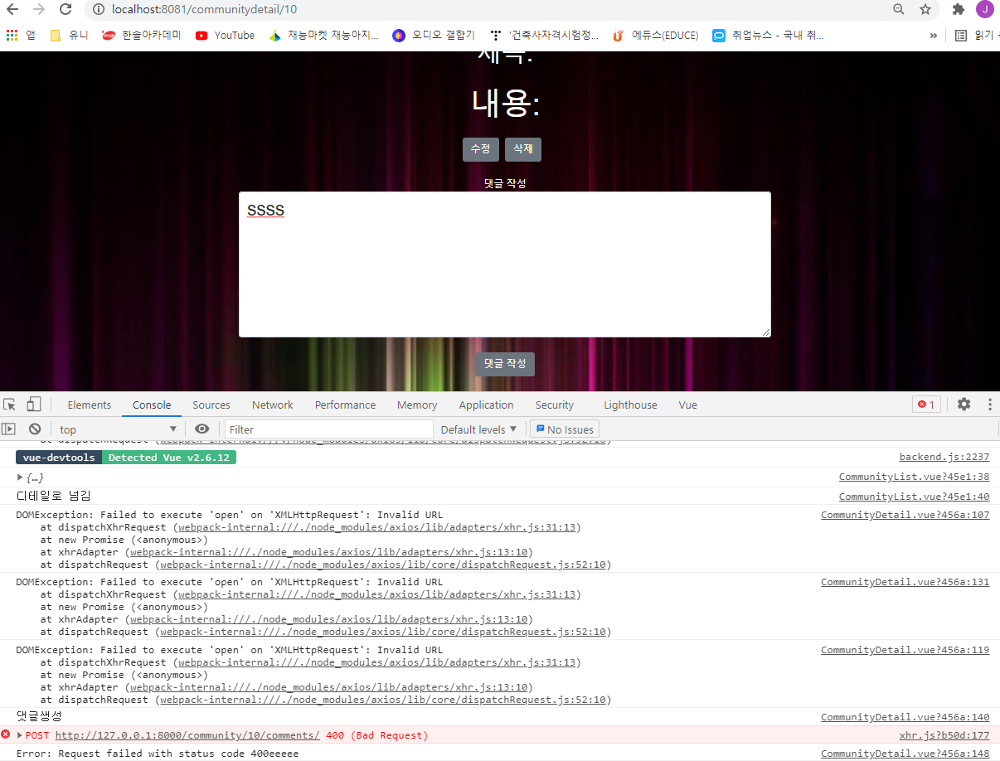

## ERROR

**교수님... 휴일까지 ... 감사드려요!!!👍👍**




**[final-pjt-front\src\views\communitys\CommunityDetail.vue]**

```vue
  createComment: function () { //댓글생성
      const config = this.getToken()
      const commentItem = {
        content: this.comment_content,
      }
      if (commentItem.content) {
         console.log('댓글생성')
          axios.post(`${SERVER_URL}/community/${this.$route.params.community_pk}/comments/`, commentItem, config)
          .then( (res) => {
            console.log(res+"dddd")
            this.getComments()
            this.comment_content = ''
          })
          .catch((err) => {
            console.log(err+"eeeee")
          })
        }
    },
```

**[final-pjt-back\community\urls.py]**

```python
from django.urls import path
from . import views

app_name = 'community'
urlpatterns = [
    path('', views.community_list_create, name='index'),
    path('<int:community_pk>/', views.community_detail, name='detail'),
    path('<int:community_pk>/comments/', views.comments, name='comments'),
    path('<int:community_pk>/comments/<int:comment_pk>', views.comment_detail, name='comment_detail'),
]
```

**[final-pjt-back\community\views.py]**

```python
@api_view(['GET', 'POST'])
def comments(request, community_pk):
    community = get_object_or_404(Community, pk=community_pk)
    if request.method == 'POST':
        serializer = CommentSerializer(data=request.data)
        if serializer.is_valid(raise_exception=True):
            serializer.save(community=community)
            return Response(serializer.data, status=status.HTTP_201_CREATED)
    else:
        comment_list = get_list_or_404(Comment, community=community)
        serializer = CommentSerializer(comment_list, many=True)
        return Response(serializer.data)
```


.env.local

```
VUE_APP_SERVER_URL=http://127.0.0.1:8000
```

